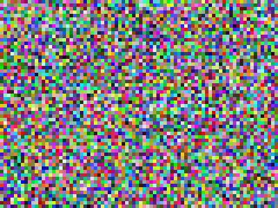
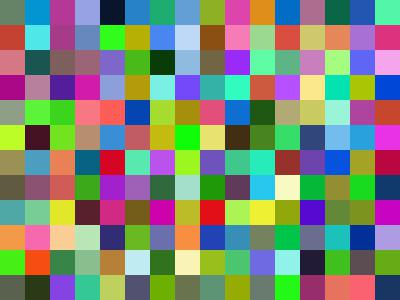
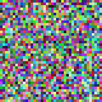

# FakeImage

> Generate fake images for testing or as placeholders

## API

### Random Generator

Generate a random image with the following URL:

```
/random-{width}-{height}-{tile}.{extension}
```

| Param | Optional | Description |
| --- | --- | --- |
| width | | width in pixels |
| height | x | height in pixels, if omitted width is used to produce square image |
| tile | x | tile size of random colors in generated image, 5 is default value |
| extension | x | png, jpg, jpeg or gif is supported |

#### Examples

##### /random-400x300.jpg



##### /random-400x300x25.jpg



##### /random-200.jpg



## Run

### Local PHP webserver

```
composer install
php -S localhost:9000 -t ./public ./config/server.php
```

### Docker

```
docker run -it --rm -p 9000:9000 stefanhuber/fakeimage
```